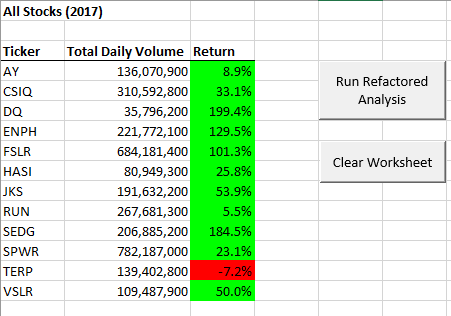
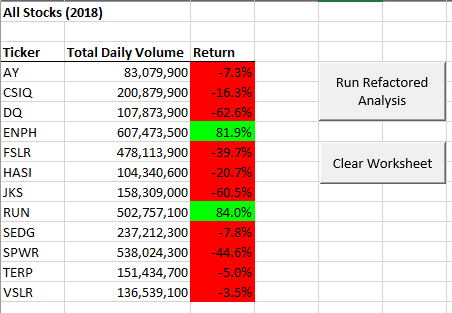
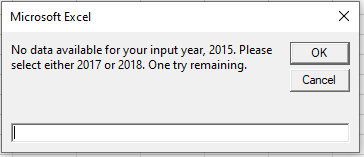

# Stocks Analysis
Module 2 Challenge

### Challenge 
---

In this challenge, we were tasked with performing analysis on 12 different stocks. Metrics we were looking for included Daily Total Volume and the Return for various years. We scripted macros to automate this process. After creating a working file, we were tasked with refactoring the code to make it run more efficiently.

### Here is the output for analysis run on the data we have for 2017:

### Here is the output for analysis run on the data we have for 2018:

---

### Notes

After refactoring the code, I found that we did not account for an input that requests a year outside of our existing dataset. To prevent this, I added a conditional statement that checked if the initial input was within the range of years we had data for. If the input falls outside this range, a mesasge box pops up asking the user to try again. In this example, I tried running the analysis on 2015.

If they enter an invalid year twice, the program ends. 

